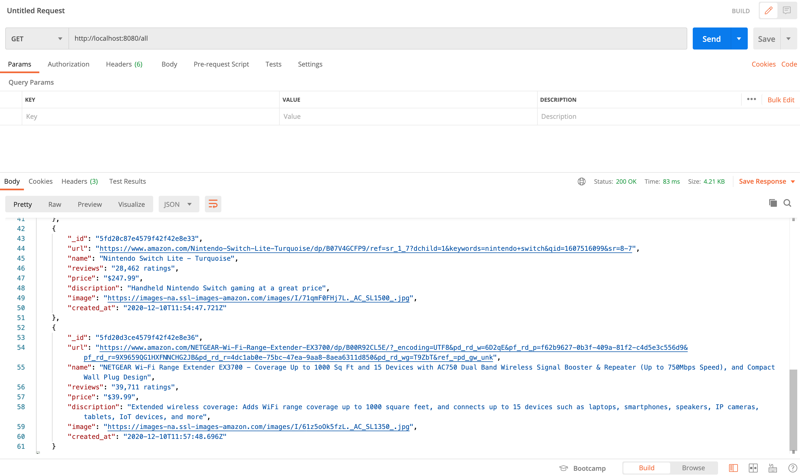
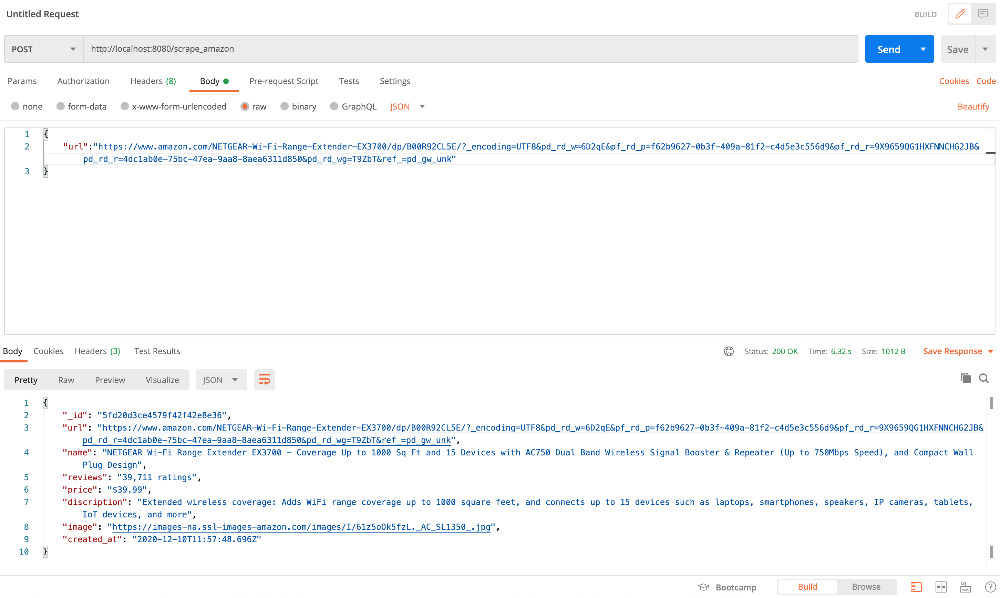

# Amazon-Web-Scrapper---GoLang
Collection of we scrapping apis to scrape a given amazon webpage url.

##Installation:

1) Git clone.
2) docker-compose up --build -d

##API Endpoints
1) URL - http://localhost:8080/all <br />
   Method - GET <br />
   Discription - To fetch all the scraped pages JSON array <br />
   Sample Response: <br />
   ```[
    {
        "_id": "5fd20b4ce4579f42f42e8e2d",
        "url": "https://www.amazon.com/Nintendo-Switch-Lite-Turquoise/dp/B07V4GCFP9/ref=sr_1_7?dchild=1&keywords=nintendo+switch&qid=1607516099&sr=8-7",
        "name": "Nintendo Switch Lite - Turquoise",
        "reviews": "28,462 ratings",
        "price": "$247.99",
        "discription": "Handheld Nintendo Switch gaming at a great price",
        "image": "https://images-na.ssl-images-amazon.com/images/I/71qmF0FHj7L._AC_SL1500_.jpg",
        "created_at": "2020-12-10T11:49:32.462Z"
    },
    {
        "_id": "5fd20d3ce4579f42f42e8e36",
        "url": "https://www.amazon.com/NETGEAR-Wi-Fi-Range-Extender-EX3700/dp/B00R92CL5E/?_encoding=UTF8&pd_rd_w=6D2qE&pf_rd_p=f62b9627-0b3f-409a-81f2-c4d5e3c556d9&pf_rd_r=9X9659QG1HXFNNCHG2JB&pd_rd_r=4dc1ab0e-75bc-47ea-9aa8-8aea6311d850&pd_rd_wg=T9ZbT&ref_=pd_gw_unk",
        "name": "NETGEAR Wi-Fi Range Extender EX3700 - Coverage Up to 1000 Sq Ft and 15 Devices with AC750 Dual Band Wireless Signal Booster & Repeater (Up to 750Mbps Speed), and Compact Wall Plug Design",
        "reviews": "39,711 ratings",
        "price": "$39.99",
        "discription": "Extended wireless coverage: Adds WiFi range coverage up to 1000 square feet, and connects up to 15 devices such as laptops, smartphones, speakers, IP cameras, tablets, IoT devices, and more",
        "image": "https://images-na.ssl-images-amazon.com/images/I/61z5oOk5fzL._AC_SL1350_.jpg",
        "created_at": "2020-12-10T11:57:48.696Z"
    }
]```


2) URL - http://localhost:8080/scrape_amazon <br />
   Method - POST <br />
   Request json:
   ```
   {
    "url":"https://www.amazon.com/NETGEAR-Wi-Fi-Range-Extender-EX3700/dp/B00R92CL5E/?_encoding=UTF8&pd_rd_w=6D2qE&pf_rd_p=f62b9627-0b3f-409a-81f2-c4d5e3c556d9&pf_rd_r=9X9659QG1HXFNNCHG2JB&pd_rd_r=4dc1ab0e-75bc-47ea-9aa8-8aea6311d850&pd_rd_wg=T9ZbT&ref_=pd_gw_unk"
    }
    ```
   Discription - To scrape a given amazon webpage url <br />
   Sample Response: <br />
   ```
    {
    "_id": "5fd2116f5f83546d4c6be47c",
    "url": "https://www.amazon.com/NETGEAR-Wi-Fi-Range-Extender-EX3700/dp/B00R92CL5E/?_encoding=UTF8&pd_rd_w=6D2qE&pf_rd_p=f62b9627-0b3f-409a-81f2-c4d5e3c556d9&pf_rd_r=9X9659QG1HXFNNCHG2JB&pd_rd_r=4dc1ab0e-75bc-47ea-9aa8-8aea6311d850&pd_rd_wg=T9ZbT&ref_=pd_gw_unk",
    "name": "NETGEAR Wi-Fi Range Extender EX3700 - Coverage Up to 1000 Sq Ft and 15 Devices with AC750 Dual Band Wireless Signal Booster & Repeater (Up to 750Mbps Speed), and Compact Wall Plug Design",
    "reviews": "39,711 ratings",
    "price": "$39.99",
    "discription": "Extended wireless coverage: Adds WiFi range coverage up to 1000 square feet, and connects up to 15 devices such as laptops, smartphones, speakers, IP cameras, tablets, IoT devices, and more",
    "image": "https://images-na.ssl-images-amazon.com/images/I/61z5oOk5fzL._AC_SL1350_.jpg",
    "created_at": "2020-12-10T12:15:43Z"
    }
    ```


#### Mongodb Atlas is used as document store. Please change the `ApplyURI` in the code.

### References:

- https://www.thepolyglotdeveloper.com/2019/02/developing-restful-api-golang-mongodb-nosql-database/
- https://www.mongodb.com/blog/post/quick-start-golang--mongodb--how-to-create-documents
- https://golang.org/doc/
- https://github.com/gocolly/colly
- https://medium.com/the-andela-way/build-a-restful-json-api-with-golang-85a83420c9da#:~:text=We%20create%20a%20new%20folder,and%20change%20directory%20into%20it.&text=We%20then%20create%20an%20entry,is%20the%20main.go%20file.&text=Open%20the%20main.go%20file,app%20using%20the%20main%20function.

